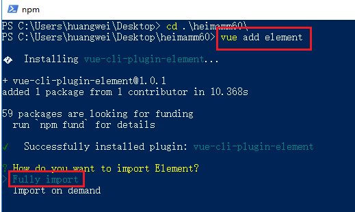

# Day01

## 项目介绍

### 项目功能介绍

一款类似于驾考宝典的综合应用，课程的重点是后台管理部分

### 项目涉及到的技术点

- vue
- vue-router
- vuex
- element-ui
- moment

## 项目后台搭建

### 后台API接口地址：

https://www.showdoc.com.cn/538567623707717?page_id=3183007410635536

### 搭建步骤：

> 为了方便开发，咱们把后台接口部署到本地方便调用，后续打包时，再切换到在线地址

1. 安装`phpStudy2018`

   1. 版本需要是这个，低版本中无法设置php的版本信息

   2. 解压之后安装到任意非中文目录

   3. 如果已经安装这一步可以省略

2. 打开`phpStudy2018`

   1. 安装完毕提示的内容全部允许

   2. 如果双击提示已经打开，在任务栏找

   3. 确保`apache`和`mysql`都运行起来了


3. 选择版本

	1.  在`phpStudy2018`主界面选择`切换版本`

	2.  选择`php-7.1.13-nts + Apache`
		
	3.  因为开发的语言是这个版本


4. 拷贝接口

   1. 在主界面点击`其他选项菜单->网站根目录`

   2. 进入到`www`目录

   3. 将项目克隆到这个目录

   4. 项目的git地址:  https://gitee.com/phper_leo/heimamm.git

```
git clone https://gitee.com/phper_leo/heimamm.git
```


5. 项目安装
   1. 在确保主界面的MySQL和Apache都启动成功的情况下
   2.   打开浏览器访问http://127.0.0.1/heimamm/public/
   3. 自动引导到安装界面


6. 测试访问

   1. 在确保主界面的`MySQL`和`Apache`都启动成功的情况下
   2. 打开浏览器访问`http://127.0.0.1/heimamm/public/captcha?type=login`
   3. 能看到验证码说明开启成功

   

### 注意事项：

在执行上述操作过程中，可能会提示缺少`VC`，按照下面步骤操作就好

1. 如果在安装的时候提示缺少`vc`
2. 根据提示的内容进行安装即可

**项目搭建好了之后，每天开启电脑之后的第一件事，就是把`phpStdudy2018`开启**

**一般情况下都会ok，但是也有同学就是安装不成功，或是使用Mac系统的同学，那么就私聊我，我发一个线上地址给你**

## 创建项目 & 集成ElementUI

###生成项目步骤：

1. 打开终端，切换到非中文目录下**（最好就是桌面）**，执行`vue create heimamm60`

2. 选择`Manually select features`

3. 按住键盘的`上下键`进行切换，按住`空格`进行选择，选择所需要的内容，选择上`Choose Vue version`、`Babel`、`Router`、`Vuex`、`CSS Pre-processors`、`Linter / Formatter`，最后`按回车`进入下一步

4. 版本选择`2.x`、路由模式选择hash模式`n`、预处理语言选择`Less`、ESLint相关都选择第一个、项目配置选择`In dedicated config files`代表配置都写入到单独的配置文件中，不写在`package.json`中、是否保留刚刚上面的所有选择以供下一次使用`n`
	  

5. 接下来就会生成项目，安装依赖包**（这一步要保证网速流畅，否则容易安装包失败）**

6. 最后，等项目都生成好了，并且包也安装没有问题了，执行`cd heimamm60`、`npm run serve`查看效果

### 项目中集成`element-ui`：

1. 把终端切换到项目所在目录，执行`vue add element`，选择`Fully Import`，按回车
	
2. `Do you wish to overwrite Element's SCSS variables`选择`N`，按回车
3. `Choose the locale you want to load`选择`zh-CN`，按回车
4. 接下来就是安装`element-ui`并且在项目中集成了

 ## 项目路由配置

1. 在`src/views`目录创建好我们项目所需要的页面和组件，`login/Login.vue`、`login/Register.vue`、`layout/welcome/Index.vue`、`layout/user/Index.vue`、`layout/user/Add-or-update.vue`、`layout/subject/Index.vue`、`layout/subject/Add-or-update.vue`、`layout/enterprise/Index.vue`、`layout/enterprise/Add-or-update.vue`、`layout/question/Index.vue`、`layout/question/Add-or-update.vue`、`layout/question/Question-type.vue`、`layout/question/Upload-file.vue`、`layout/chart/Index.vue`

2. 在`src/router/index.js`中引入上一步的页面，并且进行路由的配置（包括404的配置），代码如下

   ```js
   import Vue from 'vue'
   import VueRouter from 'vue-router'
   Vue.use(VueRouter)
   
   // 导入页面
   import Login from '../views/login/Login'
   import Layout from '../views/layout/Index'
   import Welcome from '../views/layout/welcome/Index'
   import Chart from '../views/layout/chart/Index'
   import User from '../views/layout/user/Index'
   import Question from '../views/layout/question/Index'
   import Enterprice from '../views/layout/enterprise/Index'
   import Subject from '../views/layout/subject/Index'
   import NotFound from '../views/404/NotFound'
   
   const routes = [
     {
       path: '/login',
       name: 'Login',
       component: Login
     },
     {
       path: '/',
       redirect: '/login'
     },
     {
       path: '/layout',
       component: Layout,
       children: [
         {
           path: 'welcome',
           component: Welcome
         },
         {
           path: '',
           redirect: 'welcome'
         },
         {
           path: 'chart',
           component: Chart
         },
         {
           path: 'user',
           component: User
         },
         {
           path: 'question',
           component: Question
         },
         {
           path: 'enterprise',
           component: Enterprice
         },
         {
           path: 'subject',
           component: Subject
         },
         {
           path: '*',
           component: NotFound
         }
       ]
     },
     {
       path: '*',
       component: NotFound
     }
   ]
   
   const router = new VueRouter({
     routes
   })
   
   export default router
   ```

3. 直接在浏览器中输入地址，进行测试下，没有问题之后，再进行下一步

## 全局样式配置

1. 在`src/assets`目录下创建一个`styles`文件夹，里面再创建一个`base.less`的文件，里面写好一些全局通用配置的less代码

2. 在`main.js`中或是`App.vue`的`<style lang="less"></style>`引入都可以（二者选择其一即可），但是两者引入时候的写法是不一样的，在`main.js`中引入，可以直接这样写

   ```js
   // 引入全局样式
   import './assets/styles/base.less'
   ```

   在`App.vue`的`<style lang="less"></style>`引入，可以这样写

   ```vue
   <style lang="less">
   @import './assets/styles/base.less';
   </style>
   ```

3. 运行项目`npm run serve`看下效果，看下全局样式是否起了作用

## 全局axios配置

### 目标：

1. 设置好axios的`基准路径`、`允许携带cookies`
2. 设置好请求拦截器、响应拦截器，为将来具体的业务逻辑处理留好位置
3. 把axios实例绑定到vue的原型上，方便在项目的每一个页面或是组件中获取到

### 实现步骤：

1. 在`src`目录下，创建一个`utils`文件夹，里面写好一个`request.js`文件

2. 在`request.js`文件中写好`基准路径`、`拦截器`、`挂载到原型上`等相关代码

   ```js
   import Vue from "vue";
   import axios from "axios";
   
   // 设置基础路径
   axios.defaults.baseURL = process.env.VUE_APP_BASEURL;
   // 允许携带cookies
   axios.defaults.withCredentials = true;
   
   // Add a request interceptor
   // 请求拦截器
   axios.interceptors.request.use(
     function(config) {
       // Do something before request is sent
       
       return config;
     },
     function(error) {
       // Do something with request error
       return Promise.reject(error);
     }
   );
   
   // 响应拦截器
   // Add a response interceptor
   axios.interceptors.response.use(
     function(response) {
       // Do something with response data
       
       return response;
     },
     function(error) {
       // Do something with response error
       return Promise.reject(error);
     }
   );
   
   Vue.prototype.$axios = axios;
   ```

3. 在`main.js`中引入即可

   ```js
   // 导入 request(封装了axios)
   import '@/utils/request.js'
   ```

###注意事项：

在设置基准路径的时候，使用到了`process.env.VUE_APP_BASEURL`，这个是Vue的环境变量设置，可以参考：https://cli.vuejs.org/zh/guide/mode-and-env.html#%E6%A8%A1%E5%BC%8F

代码中的`@`代表的是`src`目录

## 项目其它配置

### 关掉ESLint的检查

由于我们生成项目的时候，选择了eslint，但是由于我们写代码的时候，可能会觉得它很烦，如果我们想要关掉eslint的检查，该怎么做呢？

可以在项目根目录下创建一个文件`vue.config.js`，在里面写上代码，来关闭掉eslint的检查

```js
// vue.config.js
module.exports = {
  // 选项...
  lintOnSave: false // 关闭掉eslint的检查
}
```

## 登录

### 效果


### 涉及到的知识点分析

- element-ui中`el-form`、`el-input`、`el-row`、`el-col`、`el-button`等子组件的使用
- axios发送网络请求

### 实现步骤：

#### UI界面搭建：

登录页面中使用到了element-ui的`el-form`和`el-input`等等子组件，建议在使用之前先看看他们的官方文档，然后将他们移植到我们自己的项目中，`el-form`文档地址：https://element.eleme.cn/#/zh-CN/component/form#biao-dan-yan-zheng

```vue
<template>
  <div class="login-container">
    <div class="left">
      <div class="title-box">
        
        <span class="title">黑马面面</span>
        <span class="line"></span>
        <span class="sub-title">用户登录</span>
      </div>
      <!-- form表单部分 -->
      <el-form
        :model="loginForm"
        :rules="rules"
        ref="loginFormRef"
        class="login-form"
      >
        <el-form-item prop="phone">
          <el-input
            prefix-icon="el-icon-user"
            placeholder="请输入手机号"
            v-model="loginForm.phone"
          ></el-input>
        </el-form-item>
        <el-form-item prop="password">
          <el-input
            v-model="loginForm.password"
            prefix-icon="el-icon-lock"
            placeholder="请输入密码"
            show-password
          ></el-input>
        </el-form-item>
        <el-form-item prop="code">
          <el-row :gutter="18">
            <el-col :span="16">
              <el-input
                v-model="loginForm.code"
                prefix-icon="el-icon-key"
                placeholder="请输入验证码"
              ></el-input>
            </el-col>
            <el-col :span="8">
              
            </el-col>
          </el-row>
        </el-form-item>
        <el-form-item prop="isCheck">
          <el-checkbox v-model="loginForm.isCheck"></el-checkbox>
          我已阅读并同意<el-link type="primary" href="http://www.baidu.com"
            >用户协议</el-link
          >和<el-link type="primary" href="http://www.baidu.com"
            >隐私条款</el-link
          >
        </el-form-item>
        <el-form-item>
          <el-button style="width:100%" @click="loginClick" type="primary"
            >登录</el-button
          >
        </el-form-item>
        <el-form-item>
          <el-button style="width:100%" @click="register" type="primary"
            >注册</el-button
          >
        </el-form-item>
      </el-form>
    </div>
    <div class="right">
      
    </div>
  </div>
</template>

<style lang="less">
.login-container {
  height: 100%;
  display: flex;
  align-items: center;
  justify-content: space-around;
  background: linear-gradient(225deg, #1493fa, #01c6fa);
  .left {
    width: 478px;
    height: 550px;
    background: #f5f5f5;
    padding: 48px;
    .title-box {
      display: flex;
      align-items: center;
      img {
        width: 22px;
        height: 17px;
        margin-right: 16px;
      }
      .title {
        font-size: 24px;
        margin-right: 14px;
      }
      .line {
        width: 1px;
        background-color: #c7c7c7;
        height: 27px;
        margin-right: 12px;
      }
      .sub-title {
        font-size: 22px;
      }
    }
    .login-form {
      margin-top: 29px;
      .captcha {
        width: 100%;
        height: 40px;
      }
    }
  }
}
</style>
```

#### 登录功能实现

```vue
<script>
// 按需导入
import { setToken } from "@/utils/token"
export default {
  name: "Login",
  data() {
    return {
      codeURL: process.env.VUE_APP_BASEURL + "/captcha?type=login",
      loginForm: {
        // 模型
        phone: "18511111111", // 手机号
        password: "12345678", // 密码
        code: "", // 验证码
        isCheck: true, // 是否勾选了用户协议
      },
      rules: {
        // 校验规则
        phone: [
          // 是个数组，代表这个里面可以写多个校验规则
          // { required: true, message: "必须输入手机号", trigger: "blur" },
          // { min: 11, max: 11, message: "手机号必须是11位", trigger: "blur" },
          {
            validator: (rule, value, callback) => {
              if (!value) {
                callback(new Error("手机号不能为空"));
                return;
              }

              // 手机号的正则表达式
              const reg = /^1[3456789][0-9]{9}$/;
              if (!reg.test(value)) {
                return callback(new Error("手机号不合法"));
              }

              callback();
            },
            trigger: "blur",
          },
        ],
        password: [
          { required: true, message: "必须输入密码", trigger: "blur" },
          {
            min: 6,
            max: 12,
            message: "长度在 6 到 12 个字符",
            trigger: "blur",
          },
        ],
        code: [
          { required: true, message: "必须输入验证码", trigger: "blur" },
          {
            min: 4,
            max: 4,
            message: "长度必须是4位",
            trigger: "blur",
          },
        ],
        isCheck: [
          {
            validator: (rule, value, callback) => {
              if (!value) {
                return callback(new Error("必须勾选用户协议"));
              }

              callback();
            },
            trigger: "change",
          },
        ],
      },
    };
  },
  methods: {
    // 获取验证码
    getCode() {
      this.codeURL =
        process.env.VUE_APP_BASEURL +
        "/captcha?type=login&t=" +
        (new Date() - 0);
    },
    // 登录
    loginClick() {
      this.$refs.loginFormRef.validate(async (valid) => {
        if (!valid) return;
        
        // 发送登录请求
        const res = await this.$axios.post("/login", this.loginForm);

        if (res.data.code === 200) {
          // 提示
          this.$message({
            message: "登录成功~",
            type: "success",
          });

          // 保存token
          setToken(res.data.data.token);

          // 跳转到后台管理页面
          this.$router.push("/layout/welcome");
        } else {
          this.$message.error(res.data.message);

          this.codeURL =
            process.env.VUE_APP_BASEURL +
            "/captcha?type=login&t=" +
            (new Date() - 0);
        }
      });
    }
  }
}
</script>
```

#### 注意事项：

1. 因为登录成功之后，涉及到保存token到本地，所有我们需要创建一个模块，来实现token的保存及其他相关操作，我们可以在`src/utils`文件夹下，创建一个`token.js`文件，里面写好有关token的操作

   ```js
   const KEY = 'heimamm_token'
   
   const setToken = token => {
       localStorage.setItem(KEY,token)
   }
   
   const getToken = () => {
       return localStorage.getItem(KEY)
   }
   
   const removeToken = () => {
       localStorage.removeItem(KEY)
   }
   
   // 按需导出 导出对象
   export {setToken,getToken,removeToken}
   ```

2. 在点击验证码图片，获取新的验证码的时候，因为它是发送的GET请求，我们需要在它的`url`后面加一个随机参数才能解决浏览器对于GET请求缓存的问题