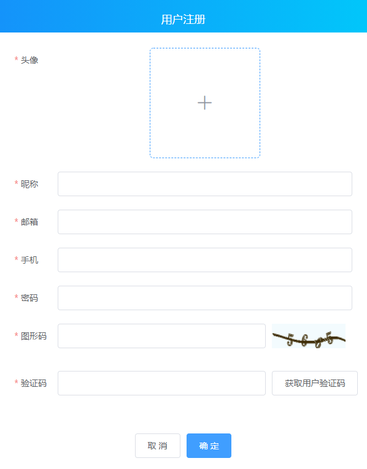
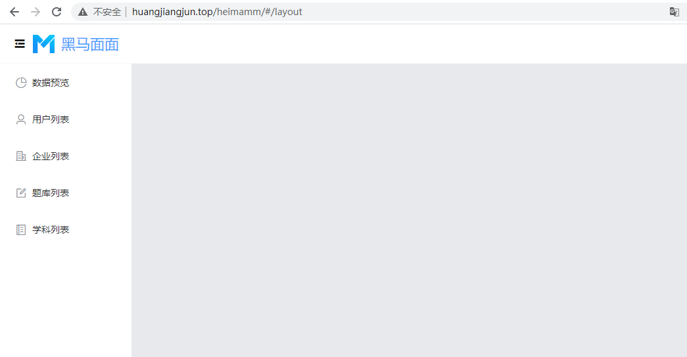

# Day02

## 注册

### 效果：



### 实现步骤：

#### UI搭建：

```vue
<template>
  <div>
    <el-dialog title="注册" :visible.sync="dialogVisible" width="600px" center>
      <!--
        model: 提交给服务器的模型值
       -->
      <el-form
        :model="registerForm"
        ref="registerFormRef"
        :rules="rules"
        label-width="70px"
        label-position="left"
      >
        <!--
         prop 要写在el-form-item，并且prop的值要跟rules中保持一致
        -->
        <el-form-item label="头像" prop="avatar">
          <!--
            action：上传的地址，它上传跟axios没有关系，它是自己封装的，地址要写全
            data：上传时候需要传递的参数，按照接口文档，它的属性名叫 image
            show-file-list：是否展示列表
            before-upload：上传之前，需要做两件事，第一是格式和大小判断，第二把它里面的参数 file 赋值给
                el-upload属性的data中的image
            on-success：上传成功之后，需要做两件事，第一头像上传的框中的图片要变成预览图片(就是给imageUrl)
                      第二件事情是，把上传得到的服务器地址（"file_path":"uploads/20191024/d79f16177aa4d3bf4d2e2398f41c6d68.PNG"）
                      赋值给 registerForm.avatar
           -->
          <el-upload
            class="avatar-uploader"
            :action="uploadUrl"
            :data="uploadObj"
            :show-file-list="false"
            :before-upload="beforeAvatarUpload"
            :on-success="handleAvatarSuccess"
          >
            
            <i v-else class="el-icon-plus avatar-uploader-icon"></i>
          </el-upload>
        </el-form-item>
        <el-form-item label="昵称" prop="username">
          <el-input v-model="registerForm.username"></el-input>
        </el-form-item>
        <el-form-item label="邮箱" prop="email">
          <el-input v-model="registerForm.email"></el-input>
        </el-form-item>
        <el-form-item label="手机" prop="phone">
          <el-input v-model="registerForm.phone"></el-input>
        </el-form-item>
        <el-form-item label="密码" prop="password">
          <el-input v-model="registerForm.password"></el-input>
        </el-form-item>
        <el-row>
          <el-col :span="17">
            <!-- prop中虽然你在rules中设置了，但是我们el-input双向数据绑定的值，必须写在 model绑定的模型 registerForm 中 -->
            <el-form-item label="图形码" prop="code">
              <el-input v-model="registerForm.code"></el-input>
            </el-form-item>
          </el-col>
          <el-col :span="6" style="margin-left:10px;">
            
          </el-col>
        </el-row>
        <el-row>
          <el-col :span="17">
            <el-form-item label="验证码" prop="rcode">
              <el-input v-model="registerForm.rcode"></el-input>
            </el-form-item>
          </el-col>
          <el-col :span="6" style="margin-left:10px;">
            <el-button @click="getRcode">获取用户验证码</el-button>
          </el-col>
        </el-row>
      </el-form>
      <span slot="footer">
        <el-button @click="dialogVisible = false">取消</el-button>
        <el-button type="primary" @click="register">确定</el-button>
      </span>
    </el-dialog>
  </div>
</template>
```

#### 登录页面中呈现出来

当点击登录页面中的`注册`按钮的时候，显示出登录子组件

```vue
<template>
	<div>
        <register ref="registerRef"></register>
    </div>
</template>

<script>
// 导入子组件
import Register from "./Register"
export default  {
  components: {
     Register
  },
  methods: {
    register() {
	  // 拿到子组件的实例，更改子组件中的模型值，让注册子组件显示出来
      this.$refs.registerRef.dialogVisible = true
    }
  }
}
</script>
```

#### 注册功能实现：

```vue
<script>
export default {
  name: 'Register',
  data () {
    return {
      dialogVisible: false, // 决定Dialog显示
      // 提交给后台的模型（后台不需要的，不要往里面写）
      codeUrl: process.env.VUE_APP_BASEURL + 'captcha?type=sendsms', // 图形码url地址
      uploadUrl: process.env.VUE_APP_BASEURL + 'uploads', // 上传头像的地址
      imageUrl: '', // 要预览的头像地址
      uploadObj: {
        image: ''
      }, // 上传时候需要传递的参数
      registerForm: {
        username: '', // 昵称
        phone: '', // 手机号
        email: '', // 邮箱
        avatar: '', // 头像
        password: '', // 密码
        code: '', // 图形码，等下提交给后台之前，把这个属性
        rcode: '' // 验证码
      },
      // 验证规则
      rules: {
        avatar: [{ required: true, message: '头像不能为空', trigger: 'blur' }],
        username: [
          { required: true, message: '昵称不能为空', trigger: 'blur' }
        ],
        email: {
          required: true,
          validator: (rule, value, callback) => {
            /**
             * rule：规则
             * value：用户输入的值
             * callback：决定是否校验ok，如果里面没有接 new Error('xxxx')，callback必须调用
             */
            if (!value) {
              // return 阻止代码继续往下执行
              return callback(new Error('邮箱不能为空!'))
            }

            // eslint禁用
            /* eslint-disable */
            const reg = /^([a-zA-Z0-9]+[_|\_|\.]?)*[a-zA-Z0-9]+@([a-zA-Z0-9]+[_|\_|\.]?)*[a-zA-Z0-9]+\.[a-zA-Z]{2,3}$/
            // eslint启用
            /* eslint-enable */
            if (!reg.test(value)) {
              // return 阻止代码继续往下执行
              return callback(new Error('邮箱不合法!'))
            }

            // 校验ok
            callback()
          },
          trigger: 'blur'
        },
        phone: {
          required: true, // 加了这个前面就会有红星星
          validator: (rule, value, callback) => {
            /**
             * rule：规则
             * value：用户输入的值
             * callback：决定是否校验ok，如果里面没有接 new Error('xxxx')，callback必须调用
             */
            if (!value) {
              // return 阻止代码继续往下执行
              return callback(new Error('手机号不能为空!'))
            }

            const reg = /^1[3456789][0-9]{9}$/
            if (!reg.test(value)) {
              // return 阻止代码继续往下执行
              return callback(new Error('手机号不合法!'))
            }

            // 校验ok
            callback()
          },
          trigger: 'blur'
        },
        password: [
          { required: true, message: '密码不能为空', trigger: 'blur' }
        ],
        code: [{ required: true, message: '图形码不能为空', trigger: 'blur' }],
        rcode: [{ required: true, message: '验证码不能为空', trigger: 'blur' }]
      }
    }
  },
  methods: {
    // 重新获取图形验证码
    changeCodeUrl () {
      this.codeUrl = `${
        process.env.VUE_APP_BASEURL
      }captcha?type=sendsms&t=${new Date() - 0}`
    },
    // 获取手机验证码
    async getRcode () {
      if (
        this.registerForm.phone.trim().length === 0 ||
        this.registerForm.code.trim().length === 0
      ) {
        this.$message({
          message: '手机号或图形码不能为空',
          type: 'warning'
        })
        return
      }

      // 发请求
      const res = await this.$http.post('sendsms', {
        code: this.registerForm.code,
        phone: this.registerForm.phone
      })

      if (res.code === 200) {
        this.registerForm.rcode = res.data.captcha
      } else {
        this.$message.error(res.message)
        this.changeCodeUrl()
      }
    },
    // 注册
    register () {
      // 全局校验
      this.$refs.registerFormRef.validate(async valid => {
        if (!valid) return

        // 发请求
        // 删除掉不要的属性
        delete this.registerForm.code
        const res = await this.$http.post('register', this.registerForm)

        if (res.code === 200) {
          this.$message({
            message: '注册成功~',
            type: 'success'
          })

          // 关掉当前窗口
          this.dialogVisible = false

          // 清空掉内容
          this.$refs.registerFormRef.resetFields()
          this.imageUrl = ''
        } else {
          this.$message.error(res.message)
        }
      })
    },
    /**
     * 头像上传之前的回调
     * file：选取的文件本身
     */
    beforeAvatarUpload (file) {
      const isJPG =
        file.type === 'image/jpeg' ||
        file.type === 'image/png' ||
        file.type === 'image/gif'
      const isLt2M = file.size / 1024 / 1024 < 2

      if (!isJPG) {
        this.$message.error('上传头像图片只能是 JPG/PNG/GIF 格式!')
      }
      if (!isLt2M) {
        this.$message.error('上传头像图片大小不能超过 2MB!')
      }

      // 给上传的参数中的image赋值（千万不要忘记，否则服务器会报错说没有上传文件）
      this.uploadObj.image = file

      return isJPG && isLt2M
    },
    /**
     * 上传成功之后的回调
     * res：上传成功之后，服务器给的响应
     *  {
        "message":"ok",
        "code":200,
        "data":{
        "file_path":"uploads/20191024/d79f16177aa4d3bf4d2e2398f41c6d68.PNG"
        }
      }
      file：选取的文件本身，跟beforeAvatarUpload中的file是一样的
     */
    handleAvatarSuccess (res, file) {
      // console.log(res)
      // console.log(file)
      if (res.code === 200) {
        // 给要提交的模型赋值
        this.registerForm.avatar = res.data.file_path
        // 看预览效果，这个应该是base64的图片格式
        this.imageUrl = URL.createObjectURL(file.raw)

        // 这个是传统的给它赋值一个http的地址
        // this.imageUrl = process.env.VUE_APP_BASEURL + res.data.file_path
      }
    }
  }
}
</script>
```

## Layout（布局页面）

### 效果：



### 实现步骤：

#### UI渲染：

使用到了`el-container`、`el-header`、`el-aside`、`el-menu`等element-ui组件

```vue
<template>
  <el-container class="layout">
    <el-header class="header">
      <div class="left">
        <i
          @click="isCollapse = !isCollapse"
          style="font-size: 20px;"
          class="el-icon-s-fold"
        ></i>
        
        <span class="title">黑马面面</span>
      </div>
      <div class="right">
        
        <span class="name">{{ username }} 欢迎您</span>
        <el-button @click="logout" type="primary">退出</el-button>
      </div>
    </el-header>
    <el-container>
      <el-aside width="auto">
        <el-menu
          router
          :default-active="defaultActive"
          class="el-menu-vertical-demo"
          :collapse="isCollapse"
        >
         <el-menu-item index="/layout/welcome">
            <i class="el-icon-date"></i>
            <span slot="title">个人信息</span>
          </el-menu-item>
          <el-menu-item index="/layout/chart">
            <i class="el-icon-pie-chart"></i>
            <span slot="title">数据预览</span>
          </el-menu-item>
          <el-menu-item index="/layout/user">
            <i class="el-icon-user"></i>
            <span slot="title">用户列表</span>
          </el-menu-item>
          <el-menu-item index="/layout/enterprise">
            <i class="el-icon-office-building"></i>
            <span slot="title">企业列表</span>
          </el-menu-item>
          <el-menu-item index="/layout/question">
            <i class="el-icon-edit-outline"></i>
            <span slot="title">题库列表</span>
          </el-menu-item>
          <el-menu-item index="/layout/subject">
            <i class="el-icon-notebook-2"></i>
            <span slot="title">学科列表</span>
          </el-menu-item>
        </el-menu>
      </el-aside>
      <el-main style="background-color:#e8e9ec;">
        <router-view></router-view>
      </el-main>
    </el-container>
  </el-container>
</template>

<style lang="less">
.el-container {
  height: 100%;
}
.header {
  height: 60px;
  display: flex;
  align-items: center;
  justify-content: space-between;
  border-bottom: 1px solid #f3f3f3;
  .left {
    display: flex;
    align-items: center;
    .setheight {
      font-size: 20px;
    }
    .marginlr {
      margin-left: 10px;
      margin-right: 10px;
    }
    .title {
      font-size: 22px;
      color: #49a1ff;
    }
  }
  .right {
    display: flex;
    align-items: center;
    img {
      width: 43px;
      height: 43px;
      margin-right: 9px;
      border-radius: 50%;
    }
    .name {
      margin-right: 38px;
    }
  }
}
.el-menu {
  border: none;
}
.el-menu-vertical-demo:not(.el-menu--collapse) {
  width: 200px;
  min-height: 400px;
}
.main {
  background-color: #e8e9ec;
}
</style>
```

#### 获取用户信息并展示：

```vue
<script>
export default {
  data() {
    return {
      avatar: "", // 用户的头像
      username: "", // 昵称
      isCollapse: false, // 是否收起折叠菜单
      defaultActive: "", // 菜单选中的值
    };
  },
  created() {
    this.defaultActive = this.$route.fullPath;
    this.getUserInfoData();
  },
  methods: {
    // 获取用户信息
    async getUserInfoData() {
      const res = await this.$axios.get("/info")

      if (res.data.code === 200) {
        this.avatar = process.env.VUE_APP_BASEURL + "/" + res.data.data.avatar
        this.username = res.data.data.username
      } else if (res.data.code === 206) {
        // 删除token
        // 跳转回登录页面
      }
    }
  }
}
</script>
```

#### axios请求拦截器，携带token

因为获取用户信息，需要携带token给后台，所以需要在axios的请求拦截器中进行设置下

```js
import { getToken } from "@/utils/token"

// 请求拦截器
axios.interceptors.request.use(
  function(config) {
    // Do something before request is sent
    const token = getToken()
    if (token) {
      config.headers.token = token
    }

    return config;
  },
  function(error) {
    // Do something with request error
    return Promise.reject(error);
  }
)
```

#### 退出：

```vue
<script>
import { removeToken } from "@/utils/token"
export default {
   methods: {
        // 退出
        logout() {
          this.$confirm("确定退出吗?", "提示", {
            confirmButtonText: "确定",
            cancelButtonText: "取消",
            type: "warning",
          })
            .then(async () => {
              const res = await this.$axios.get("/logout");

              if (res.data.code === 200) {
                // 1、删除token
                removeToken();

                // 2、跳转到首页
                this.$router.push("/login");
              }
            })
            .catch(() => {});
        }
   } 
}
</script>
```
