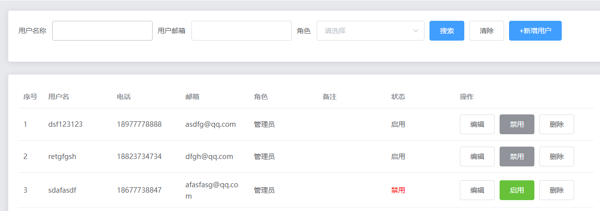
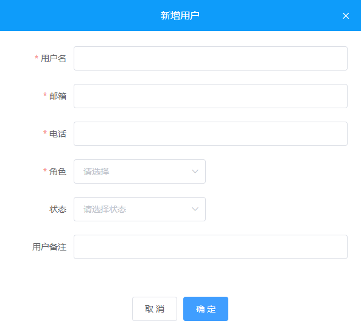
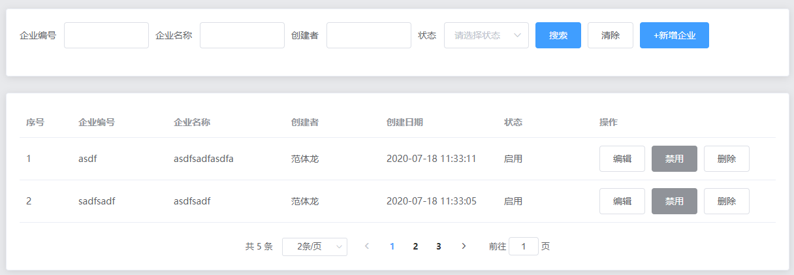
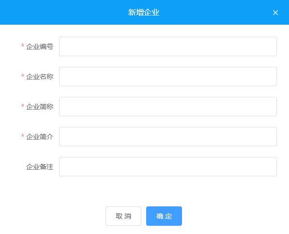

# Day03

## 用户管理

### 列表渲染

#### 效果：



#### 实现步骤：

> 获取数据

```vue
<script>
    export default {
        data() {
            return {
              searchForm: {
                username: "", // 昵称
                email: "", // 邮箱
                role_id: "", // 角色数字 1、超级管理员 2管理员、3老师、 4学生
              },
              page: 1, // 查询时候的页码
              limit: 2, // 查询时候的页容量(每页查询多少条)
              userList: [], // 展示用户列表所需要的数据
              total: 0, // 总条数，分页时候用得着
              mode: "add"
            }
        },
        created() {
            // 获取用户列表数据，用于内容展示
            this.getUserListData()
        },
        methods: {
        	async getUserListData() {
              const res = await this.$axios.get("/user/list", {
                params: {
                  page: this.page,
                  limit: this.limit,
                  ...this.searchForm
                  //   username: this.searchForm.username,
                  //   email: this.searchForm.email,
                  //   role_id: this.searchForm.role_id
                }
              })

              if (res.data.code === 200) {
                this.userList = res.data.data.items

                this.total = res.data.data.pagination.total
              }
            }     
        }
    }
</script>
```

> 渲染搜索区域 和 用户列表、分页

```vue
<template>
  <div class="user">
    <!-- 搜索部分 -->
    <el-card>
      <el-form
        inline
        :model="searchForm"
        ref="searchFormRef"
        label-width="80px"
      >
        <el-form-item label="用户名称" prop="username">
          <el-input
            style="width:150px;"
            v-model="searchForm.username"
          ></el-input>
        </el-form-item>
        <el-form-item label="用户邮箱" prop="email">
          <el-input style="width:150px;" v-model="searchForm.email"></el-input>
        </el-form-item>
        <el-form-item label="角色" prop="role_id">
          <el-select
            style="width:150px;"
            v-model="searchForm.role_id"
            placeholder="请选择"
          >
            <el-option label="超级管理员" value="1"></el-option>
            <el-option label="管理员" value="2"></el-option>
            <el-option label="老师" value="3"></el-option>
            <el-option label="学生" value="4"></el-option>
          </el-select>
        </el-form-item>
        <el-form-item>
          <el-button @click="search" type="primary">搜索</el-button>
          <el-button @click="clear" type="default">清除</el-button>
          <el-button @click="add" type="primary">+新增用户</el-button>
        </el-form-item>
      </el-form>
    </el-card>
    <!-- 内容部分 -->
    <el-card style="margin-top:20px;">
      <!-- 表格     -->
      <el-table :data="userList" stripe style="width: 100%">
        <el-table-column type="index" label="序号" width="80"></el-table-column>
        <el-table-column prop="username" label="用户名"></el-table-column>
        <el-table-column prop="phone" label="电话"></el-table-column>
        <el-table-column
          prop="email"
          label="邮箱"
          width="200"
        ></el-table-column>
        <el-table-column prop="role" label="角色"></el-table-column>
        <el-table-column prop="remark" label="备注"></el-table-column>
        <el-table-column label="状态">
          <template slot-scope="scope">
            <span v-if="scope.row.status === 0" style="color:red;">禁用</span>
            <span v-if="scope.row.status === 1" style="color:#6ac144;"
              >启用</span
            >
          </template>
        </el-table-column>
        <el-table-column label="操作" width="280">
          <template slot-scope="scope">
            <el-button @click="editUser(scope.row)" type="primary"
              >编辑</el-button
            >
            <!-- <el-button
              @click="changeStatus(scope.row.id)"
              :type="scope.row.status === 0 ? 'success' : 'info'"
              >{{ scope.row.status === 0 ? "启用" : "禁用" }}</el-button
            > -->
            <el-button
              @click="changeStatus('/user/status',scope.row.id)"
              :type="scope.row.status === 0 ? 'success' : 'info'"
              >{{ scope.row.status === 0 ? "启用" : "禁用" }}</el-button
            >
            <!-- <el-button
              @click="deleteUser(scope.row.id, scope.row.username)"
              type="default"
              >删除</el-button
            > -->
            <el-button
              @click="del('/user/remove', scope.row.id)"
              type="default"
              >删除</el-button
            >
          </template>
        </el-table-column>
      </el-table>
      <div style="margin-top:15px;text-align:center;">
        <el-pagination
          @size-change="handleSizeChange"
          @current-change="handleCurrentChange"
          :current-page="page"
          :page-sizes="[2, 5, 10, 20]"
          :page-size="limit"
          layout="total, sizes, prev, pager, next,jumper"
          :total="total"
        >
        </el-pagination>
      </div>
    </el-card>
    <user-edit ref="userEditRef" @editok="search" :mode="mode"></user-edit>
  </div>
</template>

<script>
    export default {
        methods: {
            // 搜索
            search () {
              this.page = 1 // 从第一页开始搜索

              this.getUserListData()
            },
            // 清除
            clear () {
              // this.searchForm.username = ''
              // this.searchForm.email = ''
              // this.searchForm.role_id = ''
              // 重置表单项的内容
              // 前提：我们form表单的 el-form-item 上面必须设置prop
              this.$refs.searchFormRef.resetFields()

              this.search()
            },
            // 分页条的页容量发生了改变
            handleSizeChange (val) {
              this.limit = val

              this.search()
            },
            // 分页条的当前页发生了改变
            handleCurrentChange (val) {
              this.page = val

              this.getUserListData()
            }
        }
    }
</script>
```

> 删除 & 更改状态

```vue
<script>
	export default {
        async changeStatus(id) {
          const res = await this.$axios.post("/user/status", { id });

          if (res.data.code === 200) {
            this.$message({
              message: "更改状态成功~",
              type: "success",
            });

            // 重新查询
            this.search();
          }
        },
        deleteUser(id, username) {
          this.$confirm(`确定删除 ${username} 该用户吗？`, "提示", {
            confirmButtonText: "确定",
            cancelButtonText: "取消",
            type: "warning",
          })
            .then(async () => {
              const res = await this.$axios.post("/user/remove", { id });
              if (res.data.code === 200) {
                this.$message({
                  message: "删除成功~",
                  type: "success",
                });

                // 重新查询
                this.search();
              }
            })
            .catch(() => {});
        }
    }
</script>
```

### 新增 & 修改

 #### 效果：



#### 实现步骤：

> UI渲染

```vue
<template>
  <div class="userEdit">
    <el-dialog center :visible.sync="dialogVisible" width="600px">
      <div slot="title" class="title">
        {{ mode === "add" ? "新增用户" : "修改用户" }}
      </div>
      <el-form :model="userForm" :rules="rules" ref="userEditFormRef" label-width="80px">
        <el-form-item label="用户名" prop="username">
          <el-input v-model="userForm.username"></el-input>
        </el-form-item>
        <el-form-item label="邮箱" prop="email">
          <el-input v-model="userForm.email"></el-input>
        </el-form-item>
        <el-form-item label="电话" prop="phone">
          <el-input v-model="userForm.phone"></el-input>
        </el-form-item>
        <el-form-item label="角色" prop="role_id">
          <el-select v-model="userForm.role_id" placeholder="请选择">
            <el-option label="超级管理员" :value="1"> </el-option>
            <el-option label="管理员" :value="2"> </el-option>
            <el-option label="老师" :value="3"> </el-option>
            <el-option label="学生" :value="4"> </el-option>
          </el-select>
        </el-form-item>
        <el-form-item label="状态" prop="status">
          <el-select v-model="userForm.status" placeholder="请选择状态">
            <el-option label="启用" :value="1"> </el-option>
            <el-option label="禁用" :value="0"> </el-option>
          </el-select>
        </el-form-item>
        <el-form-item label="用户备注" prop="remark">
          <el-input v-model="userForm.remark"></el-input>
        </el-form-item>
      </el-form>
      <span slot="footer">
        <el-button @click="dialogVisible = false">取 消</el-button>
        <el-button type="primary" @click="submit">确 定</el-button>
      </span>
    </el-dialog>
  </div>
</template>

<script>
	export default {
        data () {
        return {
          dialogVisible: false,
          mode: "", // 模式，add 代表新增  edit 代表修改
          userForm: {
            username: '', // 用户名
            email: '', // 邮箱
            phone: '', // 手机号
            role_id: '', // 角色 1：超级管理员 2：管理员 3：老师 4：学生
            status: '', // 状态 1：启用 0：禁用
            remark: '' // 备注
          },
          rules: {
            username: [
              { required: true, message: '用户名不能为空', trigger: 'blur' }
            ],
            email: [
              {
                required: true,
                validator: (rule, value, callback) => {
                  if (!value) {
                    callback(new Error('邮箱不能为空'))
                    return
                  }

                  // 邮箱的正则
                  const reg = /^([a-zA-Z]|[0-9])(\w|\-)+@[a-zA-Z0-9]+\.([a-zA-Z]{2,4})$/
                  if (!reg.test(value)) {
                    return callback(new Error('邮箱不合法!'))
                  }

                  callback()
                }
              }
            ],
            phone: [
              {
                required: true,
                validator: (rule, value, callback) => {
                  if (!value) {
                    callback(new Error('手机号不能为空'))
                    return
                  }

                  // 手机的正则
                  const reg = /^1[3456789][0-9]{9}$/
                  if (!reg.test(value)) {
                    return callback(new Error('手机号不合法!'))
                  }

                  callback()
                },
                trigger: 'blur'
              }
            ],
            role_id: [
              { required: true, message: '请选择用户角色', trigger: 'change' }
            ],
            status: [
              { required: true, message: '请选择用户状态', trigger: 'change' }
            ],
            remark: [{ required: true, message: '备注不能为空', trigger: 'blur' }]
          }
        }
      }
    }
</script>

<style lang="less">
.userEdit {
  .title {
    height: 53px;
    text-align: center;
    color: #fff;
    background-color: #0e9cfa;
    line-height: 53px;
  }
  .el-dialog__header {
    padding: 0;
  }
  .el-dialog__headerbtn .el-dialog__close {
    color: #fff;
  }
}
</style>
```

> 新增、修改实现

```vue
<script>
	export default {
        methods: {
            submit () {
              this.$refs.userEditFormRef.validate(async valid => {
                if (!valid) return

                let res = null
                if (this.mode === 'add') {
                  res = await this.$axios.post('/user/add', this.userForm)
                } else {
                  // delete this.userForm.create_time
                  // delete this.userForm.update_time
                  // 修改
                  res = await this.$axios.post('/user/edit', this.userForm)
                }

                if (res.data.code === 200) {
                  // 提示
                  this.$message({
                    message: this.mode === 'add' ? '新增成功~' : '编辑成功~',
                    type: 'success'
                  })

                  // 关闭当前的对话框
                  this.dialogVisible = false

                  // 刷新父组件中的数据
                  // 第一种 this.$emit()
                  // 第二种 this.$parent.search()
                  // this.$parent.search()
                  this.$emit('editok')
                } else {
                  this.$message.error(res.data.message)
                }
              })
            }
        }
    }
</script>
```

## 企业列表

### 列表渲染

#### 效果：



#### 实现步骤：

> 获取数据

```vue
<script>
    export default {
        created () {
           this.getEnterpriseListData()
        },
        data () {
           return {
              searchForm: {
                eid: '', // 企业编号
                name: '', // 企业名称
                username: '', // 创建者
                status: '' // 状态
              },
              page: 1, // 页码
              limit: 2, // 页容量
              enterpriseList: [], // table展示所需要的数据
              total: 0 // 总条数
          }
        },
        methods: {
            async getEnterpriseListData () {
              const res = await this.$axios.get('/enterprise/list', {
                params: {
                  page: this.page,
                  limit: this.limit,
                  ...this.searchForm
                }
              })

              if (res.data.code === 200) {
                this.enterpriseList = res.data.data.items

                this.total = res.data.data.pagination.total
              }
            }
        }
    }
</script>
```

> 渲染搜索区域、企业列表、分页

```vue
<template>
  <div>
    <el-card>
      <!-- 搜索部分 -->
      <el-form
        inline
        :model="searchForm"
        ref="searchFormRef"
        label-width="80px"
      >
        <el-form-item label="企业编号" prop="eid">
          <el-input style="width:150px;" v-model="searchForm.eid"></el-input>
        </el-form-item>
        <el-form-item label="企业名称" prop="name">
          <el-input style="width:150px;" v-model="searchForm.name"></el-input>
        </el-form-item>
        <el-form-item label="创建者" prop="username">
          <el-input
            style="width:150px;"
            v-model="searchForm.username"
          ></el-input>
        </el-form-item>
        <el-form-item label="创建者" prop="status">
          <el-select
            style="width:150px;"
            v-model="searchForm.status"
            placeholder="请选择状态"
          >
            <el-option label="启用" :value="1"> </el-option>
            <el-option label="禁用" :value="0"> </el-option>
          </el-select>
        </el-form-item>
        <el-form-item>
          <el-button type="primary" @click="search">搜索</el-button>
          <el-button @click="clear">清除</el-button>
          <el-button type="primary" @click="add">+新增企业</el-button>
        </el-form-item>
      </el-form>
    </el-card>
    <el-card style="margin-top:15px;">
      <!-- 列表和分页部分 -->
      <el-table :data="enterpriseList" border stripe>
        <el-table-column type="index" label="序号" width="50">
        </el-table-column>
        <el-table-column prop="eid" label="企业编号"> </el-table-column>
        <el-table-column prop="name" label="企业名称"> </el-table-column>
        <el-table-column prop="username" label="创建者"> </el-table-column>
        <el-table-column prop="create_time" label="创建日期" width="200">
        </el-table-column>
        <el-table-column label="状态">
          <template slot-scope="scope">
            <span
              :style="{ color: scope.row.status === 0 ? 'red' : '#87cd67' }"
              >{{ scope.row.status === 0 ? '禁用' : '启用' }}</span
            >
          </template>
        </el-table-column>
        <el-table-column label="操作" width="280">
          <template slot-scope="scope">
            <el-button @click="editEnterprise(scope.row)" type="primary"
              >编辑</el-button
            >
            <el-button
              @click="changeStatus(scope.row.id)"
              :type="scope.row.status === 0 ? 'success' : 'info'"
            >
              {{ scope.row.status === 0 ? '启用' : '禁用' }}
            </el-button>
            <el-button @click="del(scope.row.id)">删除</el-button>
          </template>
        </el-table-column>
      </el-table>
      <div style="margin-top:15px;text-align:center;">
        <el-pagination
          @size-change="sizeChange"
          @current-change="currentChange"
          :current-page="page"
          :page-sizes="[2, 5, 10, 20]"
          :page-size="limit"
          layout="total, sizes, prev, pager, next, jumper"
          :total="total"
          background
        >
        </el-pagination>
      </div>
    </el-card>
    <enterprise-edit ref="enterpriseEditRef" @search="search"></enterprise-edit>
  </div>
</template>

<script>
	export default {
        methods: {
            // 查询
            search () {
              this.page = 1

              this.getEnterpriseListData()
            },
            // 清除
            clear () {
              this.$refs.searchFormRef.resetFields()

              this.search()
            },
            // 页容量发生改变
            sizeChange (val) {
              this.limit = val

              this.search()
            },
            // 当前页码发生了改变
            currentChange (val) {
              this.page = val

              this.getEnterpriseListData()
            }
        }
    }
</script>
```

> 删除 & 更改状态

```vue
<script>
	export default {
        methods: {
            async changeStatus (id) {
                const res = await this.$axios.post('/enterprise/status', { id })
                if (res.data.code === 200) {
                    // 提示
                    this.$message({
                        type: 'success',
                        message: '更改状态成功~'
                    })

                    // 重新调用获取方法刷新
                    this.getEnterpriseListData()
                }
            },
            del (id) {
                this.$confirm('确定删除该数据吗？', '提示', {
                    confirmButtonText: '确定',
                    cancelButtonText: '取消',
                    type: 'warning'
                })
                    .then(async () => {
                    const res = await this.$axios.post('/enterprise/remove', { id })

                    if (res.data.code === 200) {
                        // 提示
                        this.$message({
                            type: 'success',
                            message: '删除成功~'
                        })

                        // 调用search方法刷新
                        this.search()
                    }
                })
                    .catch(() => {})
            }
        }
    }
</script>
```

### 新增 & 修改

#### 效果：



#### 实现步骤：

> UI渲染

```vue
<template>
  <div class="enterprise">
    <el-dialog :visible.sync="dialogVisible" center width="600px">
      <div slot="title" class="title">
        {{ mode === "add" ? "新增企业" : "修改企业" }}
      </div>
      <el-form
        :rules="rules"
        :model="enterpriseForm"
        ref="enterpriseFormRef"
        label-width="80px"
      >
        <el-form-item label="企业编号" prop="eid">
          <el-input v-model="enterpriseForm.eid"></el-input>
        </el-form-item>
        <el-form-item label="企业名称" prop="name">
          <el-input v-model="enterpriseForm.name"></el-input>
        </el-form-item>
        <el-form-item label="企业简称" prop="short_name">
          <el-input v-model="enterpriseForm.short_name"></el-input>
        </el-form-item>
        <el-form-item label="企业简介" prop="intro">
          <el-input v-model="enterpriseForm.intro"></el-input>
        </el-form-item>
        <el-form-item label="企业备注" prop="remark">
          <el-input v-model="enterpriseForm.remark"></el-input>
        </el-form-item>
      </el-form>
      <span slot="footer">
        <el-button @click="dialogVisible = false">取 消</el-button>
        <el-button type="primary" @click="submit">确 定</el-button>
      </span>
    </el-dialog>
  </div>
</template>

<script>
	export default {
          data () {
            return {
              dialogVisible: false,
              mode: '', // 新增(add) & 修改(edit)
              enterpriseForm: {
                // 提交给后台的数据
                eid: '', // 企业编号
                name: '', // 企业名称
                short_name: '', // 简称
                intro: '', // 企业简介
                remark: '' // 备注
              },
              rules: {
                eid: [{ required: true, message: '企业编号不能为空', trigger: 'blur' }],
                name: [
                  { required: true, message: '企业名称不能为空', trigger: 'blur' }
                ],
                short_name: [
                  { required: true, message: '企业简称不能为空', trigger: 'blur' }
                ],
                intro: [
                  { required: true, message: '企业简介不能为空', trigger: 'blur' }
                ],
                remark: [
                  { required: true, message: '企业备注不能为空', trigger: 'blur' }
                ]
              }
            }
          }
    }
</script>

<style lang="less">
.enterprise {
  .title {
    text-align: center;
    color: #fff;
    background-color: #0e9ff9;
    height: 53px;
    line-height: 53px;
  }
  .el-dialog__header {
    padding: 0px;
  }
  .el-dialog__headerbtn .el-dialog__close {
    color: #fff;
  }
}
</style>
```

> 新增 、修改实现

```vue
<script>
	export default {
        watch: {
            dialogVisible (newValue) {
                // if (newValue) {
                //   this.$nextTick(() => {
                //     this.$refs.enterpriseFormRef.clearValidate();
                //   });
                // }
                if (!newValue) {
                    this.$refs.enterpriseFormRef.clearValidate()
                }
            }
        },
        methods: {
            // 新增 & 修改最终点击确定调用的方法
            submit () {
                this.$refs.enterpriseFormRef.validate(async valid => {
                    if (!valid) return

                    let res = null
                    if (this.mode === 'add') {
                        res = await this.$axios.post('/enterprise/add', this.enterpriseForm)
                    } else {
                        // 修改
                        res = await this.$axios.post('/enterprise/edit', this.enterpriseForm)
                    }

                    if (res.data.code === 200) {
                        // 提示
                        this.$message({
                            type: 'success',
                            message: this.mode === 'add' ? '新增成功~' : '修改成功~'
                        })

                        // 关闭当前窗口
                        this.dialogVisible = false

                        // 调用父组件的search方法
                        // 方式1，通过 $emit
                        this.$emit('search')

                        // 方式2，通过 $parent
                        // this.$parent.search()
                    }
                })
            }
        }
    }
</script>
```

