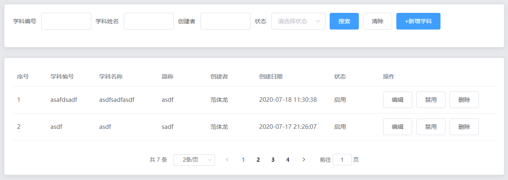
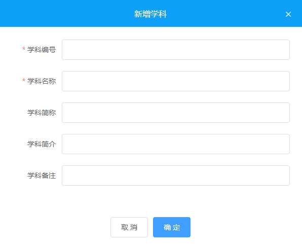

# Day05

## 学科列表

### 列表渲染

#### 效果：



#### 实现步骤：

> 获取数据

```vue
<script>
	export default {
        data () {
            return {
                searchForm: {
                    rid: '', // 学科编号
                    name: '', // 学科姓名
                    username: '', // 创建者
                    status: '' // 创建者
                },
                page: 1, // 页码
                limit: 2, // 页容量
                subjectList: [], // 学科列表数据
                total: 0 // 总条数
            }
        },
        created () {
            this.getListData()
        },
         methods: {
             async getListData () {
              const res = await this.$axios.get('/subject/list', {
                params: {
                  page: this.page,
                  limit: this.limit,
                  ...this.searchForm
                }
              })

              if (res.data.code === 200) {
                this.subjectList = res.data.data.items
                this.total = res.data.data.pagination.total
              }
            }
         }
    }
</script>
```

> 渲染搜索区域 和 学科列表、分页

```vue
<template>
  <div>
    <!-- 搜索部分 -->
    <el-card>
      <el-form
        inline
        :model="searchForm"
        ref="searchFormRef"
        label-width="80px"
      >
        <el-form-item label="学科编号" prop="rid">
          <el-input style="width:180px;" v-model="searchForm.rid"></el-input>
        </el-form-item>
        <el-form-item label="学科姓名" prop="name">
          <el-input style="width:180px;" v-model="searchForm.name"></el-input>
        </el-form-item>
        <el-form-item label="创建者" prop="username">
          <el-input
            style="width:180px;"
            v-model="searchForm.username"
          ></el-input>
        </el-form-item>
        <el-form-item label="状态" prop="status">
          <el-select
            style="width:180px;"
            v-model="searchForm.status"
            placeholder="请选择"
          >
            <el-option label="启用" value="1"></el-option>
            <el-option label="禁用" value="0"></el-option>
          </el-select>
        </el-form-item>
        <el-form-item>
          <el-button @click="search" type="primary">搜索</el-button>
          <el-button @click="clear">清除</el-button>
          <el-button @click="add" type="primary">+新增学科</el-button>
        </el-form-item>
      </el-form>
    </el-card>
    <!-- 列表、分页部分 -->
    <el-card style="margin-top:15px;">
      <el-table :data="subjectList" border stripe>
        <el-table-column type="index" width="50" />
        <el-table-column label="学科编号" prop="rid" />
        <el-table-column label="学科名称" prop="name" />
        <el-table-column label="简称" prop="short_name" />
        <el-table-column label="创建者" prop="username" />
        <el-table-column label="创建日期" prop="create_time" width="180" />
        <el-table-column label="状态">
          <template slot-scope="scope">
            <span
              :style="{ color: scope.row.status === 0 ? 'red' : '#6ac144' }"
            >
              {{ scope.row.status === 0 ? '禁用' : '启用' }}
            </span>
          </template>
        </el-table-column>
        <el-table-column label="操作" width="280">
          <template slot-scope="scope">
            <el-button type="primary" @click="editSubject(scope.row)"
              >编辑</el-button
            >
            <!-- <el-button
              :type="scope.row.status === 0 ? 'success' : 'info'"
              @click="changeStatus(scope.row.id)"
            >
              {{ scope.row.status === 0 ? "启用" : "禁用" }}
            </el-button> -->
            <el-button
              :type="scope.row.status === 0 ? 'success' : 'info'"
              @click="changeStatus('/subject/status', scope.row.id)"
            >
              {{ scope.row.status === 0 ? '启用' : '禁用' }}
            </el-button>
            <!-- <el-button type="danger" @click="del(scope.row.id)">删除</el-button> -->
            <el-button
              type="danger"
              @click="del('/subject/remove', scope.row.id)"
              >删除</el-button
            >
          </template>
        </el-table-column>
      </el-table>
      <!-- 分页 -->
      <div style="margin-top:15px;text-align:center;">
        <el-pagination
          @size-change="sizeChange"
          @current-change="currentChange"
          :current-page="page"
          :page-sizes="[2, 5, 10, 20]"
          :page-size="limit"
          layout="total, sizes, prev, pager, next, jumper"
          :total="total"
          background
        >
        </el-pagination>
      </div>
    </el-card>
    <subject-edit ref="subjectEditRef"></subject-edit>
  </div>
</template>

<script>
	export default {
        methods: {
            // 搜索
            search () {
              this.page = 1

              this.getListData()
            },
            // 清除
            clear () {
              this.$refs.searchFormRef.resetFields()

              this.search()
            },
            // 分页条的页容量发生了改变，如果是页容量发生了改变我们要从第一页开始加载
            sizeChange (val) {
              this.limit = val

              this.search()
            },
            // 当前的页码发生了改变
            currentChange (val) {
              this.page = val

              this.getListData()
            }
        }
    }
</script>
```

> 删除 & 更改状态

```vue
<script>
	export default {
        methods: {
            // 更改状态
            async changeStatus (id) {
              const res = await this.$axios.post('/subject/status', { id })

              if (res.data.code === 200) {
                // 提示
                this.$message({
                  type: 'success',
                  message: '更新状态成功~'
                })

                // 刷新表格
                this.getSubjectListData()
              }
            },
            // 删除
            del (id) {
              this.$confirm('此操作将永久删除该文件, 是否继续?', '提示', {
                confirmButtonText: '确定',
                cancelButtonText: '取消',
                type: 'warning'
              })
                .then(async () => {
                  const res = await this.$axios.post('/subject/remove', { id })

                  if (res.data.code === 200) {
                    // 提示
                    this.$message({
                      type: 'success',
                      message: '删除成功~'
                    })

                    // 刷新表格
                    this.search()
                  }
                })
                .catch(() => {})
            }
        }
    }
</script>
```

### 新增 & 修改

#### 效果：



#### 实现步骤：

> UI渲染

```vue
<template>
  <div class="subject">
    <el-dialog center :visible.sync="dialogVisible" width="600px">
      <div slot="title" class="title">
        {{ mode === 'add' ? '新增学科' : '编辑学科' }}
      </div>
      <el-form
        :model="subjectForm"
        :rules="rules"
        ref="subjectFormRef"
        label-width="80px"
      >
        <el-form-item label="学科编号" prop="rid">
          <el-input v-model="subjectForm.rid"></el-input>
        </el-form-item>
        <el-form-item label="学科名称" prop="name">
          <el-input v-model="subjectForm.name"></el-input>
        </el-form-item>
        <el-form-item label="学科简称" prop="short_name">
          <el-input v-model="subjectForm.short_name"></el-input>
        </el-form-item>
        <el-form-item label="学科简介" prop="intro">
          <el-input v-model="subjectForm.intro"></el-input>
        </el-form-item>
        <el-form-item label="学科备注" prop="remark">
          <el-input v-model="subjectForm.remark"></el-input>
        </el-form-item>
      </el-form>
      <span slot="footer">
        <el-button @click="dialogVisible = false">取 消</el-button>
        <el-button type="primary" @click="submit">确 定</el-button>
      </span>
    </el-dialog>
  </div>
</template>

<script>
	export default {
        name: 'SubjectEdit',
        data () {
            return {
                dialogVisible: false, // 控制对话框显示或是隐藏的属性
                mode: '', // 代表的操作类型 add: 新增  edit: 编辑
                subjectForm: {
                    // 这个里面定义的属性，是要提交给后台的
                    rid: '', // 学科编号
                    name: '', // 学科名称
                    short_name: '', // 学科简称
                    intro: '', // 学科简介
                    remark: '' // 备注
                },
                rules: {
                    rid: [{ required: true, message: '学科编号不能为空', trigger: 'blur' }],
                    name: [
                        { required: true, message: '学科名称不能为空', trigger: 'blur' }
                    ],
                    short_name: [
                        { required: true, message: '学科简称不能为空', trigger: 'blur' }
                    ],
                    intro: [
                        { required: true, message: '学科简介不能为空', trigger: 'blur' }
                    ],
                    remark: [
                        { required: true, message: '学科备注不能为空', trigger: 'blur' }
                    ]
                }
            }
        }
    }
</script>

<style lang="less">
.userEdit {
  .title {
    height: 53px;
    text-align: center;
    color: #fff;
    background-color: #0e9cfa;
    line-height: 53px;
  }
  .el-dialog__header {
    padding: 0;
  }
  .el-dialog__headerbtn .el-dialog__close {
    color: #fff;
  }
}
</style>
```

> 新增、修改实现

```vue
<script>
	export default {
         watch: {
            dialogVisible (newValue) {
              if (!newValue) {
                this.$refs.subjectFormRef.clearValidate()
              }
            }
          },
          methods: {
            submit () {
              this.$refs.subjectFormRef.validate(async valid => {
                if (!valid) return

                let res = null
                if (this.mode === 'add') {
                  // 新增
                  res = await this.$axios.post('/subject/add', this.subjectForm)
                } else {
                  // 修改
                  res = await this.$axios.post('/subject/edit', this.subjectForm)
                }

                if (res.data.code === 200) {
                  // 提示
                  this.$message({
                    type: 'success',
                    message: this.mode === 'add' ? '新增成功~' : '编辑成功~'
                  })

                  // 关闭当前会话框
                  this.dialogVisible = false

                  // 调用父组件的search方法
                  this.$parent.search()
                }
              })
            }
          }
    }
</script>
```

