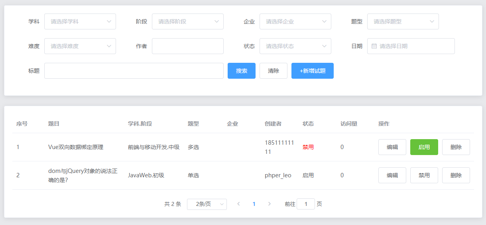
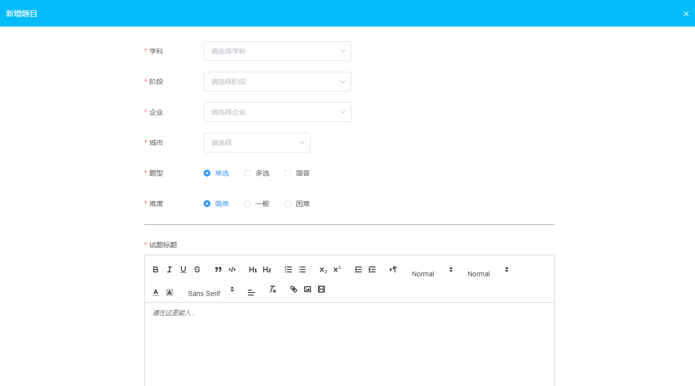

# Day06

## 题库列表

 ### 列表渲染

#### 效果：



#### 实现步骤：

>获取数据

```vue
<script>
	export default {
        name: 'Question',
        data () {
            return {
              subjectOptions: [], // 学科列表选项
              enterpriseOptions: [], // 企业列表选项
              stepOptions: [
                {
                  label: '初级',
                  value: 1
                },
                {
                  label: '中级',
                  value: 2
                },
                {
                  label: '高级',
                  value: 3
                }
              ],
              typeOptions: [
                {
                  label: '单选',
                  value: 1
                },
                {
                  label: '多选',
                  value: 2
                },
                {
                  label: '简答',
                  value: 3
                }
              ],
              difficultyOptions: [
                {
                  label: '简单',
                  value: 1
                },
                {
                  label: '一般',
                  value: 2
                },
                {
                  label: '困难',
                  value: 3
                }
              ],
              statusOptions: [
                {
                  label: '启用',
                  value: 1
                },
                {
                  label: '禁用',
                  value: 0
                }
              ],
              form: {
                // 这里面只写需要提交给后台的属性，参考后台接口文档
                subject: '', // 学科
                enterprise: '', // 企业
                step: '', // 阶段 1：初级 2：中级 3：高级
                type: '', // 题型 1：单选 2：多选 3：简答
                difficulty: '', // 难度 1：简单 2：一般 3：困难
                username: '', // 作者
                status: '', // 状态 1：启用 0：禁用
                create_date: '', // 创建日期
                title: '' // 标题
              },
              page: 1, // 当前页
              limit: 2, // 每页多少条
              total: 0, // 总条数
              list: [] // 列表数据
            }
        },
       mounted () {
        this.getSelectOptionsData()
        this.getEnterpriseOptionsData()
        this.getListData()
      },
      methods: {
        // 获取学科列表（不要分页）
        async getSelectOptionsData () {
          const res = await this.$http.get('subject/list')

          this.subjectOptions = res.data.items
        },
        // 获取企业列表（不要分页）
        async getEnterpriseOptionsData () {
          const res = await this.$http.get('enterprise/list')

          this.enterpriseOptions = res.data.items
        },
        async getListData () {
          const res = await this.$http.get('question/list', {
            params: {
              ...this.form,
              page: this.page,
              limit: this.limit
            }
          })

          this.list = res.data.items
          this.total = res.data.pagination.total
        }
    }
</script>
```

> 渲染搜索区域 和 题库列表、分页

```vue
<template>
  <div>
    <!-- 搜索区域 -->
    <el-card>
      <el-form :model="form" ref="form" label-width="80px" inline size="normal">
        <el-form-item label="学科" prop="subject">
          <el-select v-model="form.subject" placeholder="请选择学科">
            <el-option
              v-for="item in subjectOptions"
              :key="item.id"
              :label="item.name"
              :value="item.id"
            >
            </el-option>
          </el-select>
        </el-form-item>
        <el-form-item label="阶段" prop="step">
          <el-select v-model="form.step" placeholder="请选择阶段">
            <el-option
              v-for="item in stepOptions"
              :key="item.value"
              :label="item.label"
              :value="item.value"
            >
            </el-option>
          </el-select>
        </el-form-item>
        <el-form-item label="企业" prop="enterprise">
          <el-select v-model="form.enterprise" placeholder="请选择企业">
            <el-option
              v-for="item in enterpriseOptions"
              :key="item.id"
              :label="item.name"
              :value="item.id"
            >
            </el-option>
          </el-select>
        </el-form-item>
        <el-form-item label="题型" prop="type">
          <el-select v-model="form.type" placeholder="请选择题型">
            <el-option
              v-for="item in typeOptions"
              :key="item.value"
              :label="item.label"
              :value="item.value"
            >
            </el-option>
          </el-select>
        </el-form-item>
        <el-form-item label="难度" prop="difficulty">
          <el-select v-model="form.difficulty" placeholder="请选择题型">
            <el-option
              v-for="item in difficultyOptions"
              :key="item.value"
              :label="item.label"
              :value="item.value"
            >
            </el-option>
          </el-select>
        </el-form-item>
        <el-form-item label="作者" prop="username">
          <el-input style="width:180px;" v-model="form.username"></el-input>
        </el-form-item>
        <el-form-item label="状态" prop="status">
          <el-select v-model="form.status" placeholder="请选择状态">
            <el-option
              v-for="item in statusOptions"
              :key="item.value"
              :label="item.label"
              :value="item.value"
            >
            </el-option>
          </el-select>
        </el-form-item>
        <el-form-item label="日期" prop="create_date">
          <el-date-picker
            v-model="form.create_date"
            size="normal"
            placeholder="选择日期"
          >
          </el-date-picker>
        </el-form-item>
        <el-form-item label="标题" prop="title">
          <el-input style="width:450px;" v-model="form.title"></el-input>
        </el-form-item>
        <el-form-item>
          <el-button type="primary" @click="search">搜索</el-button>
          <el-button @click="clear">清除</el-button>
          <el-button type="primary" @click="add">+新增试题</el-button>
        </el-form-item>
      </el-form>
    </el-card>

    <!-- 列表和分页区域 -->
    <el-card style="margin-top:20px;">
      <!-- data-列表要展示的数据 -->
      <el-table :data="list" border stripe>
        <el-table-column label="序号" type="index"> </el-table-column>
        <!-- prop 获取每一行中对应的值来渲染 -->
        <el-table-column label="标题" width="200px">
          <template slot-scope="scope">
            <!-- 因为子组件传值的时候绑定的属性叫做row,所以我们取值的时候也是 .row -->
            <span v-html="scope.row.title"></span>
          </template>
        </el-table-column>
        <el-table-column label="学科.阶段" :formatter="formatSubjectAndStep">
        </el-table-column>
        <el-table-column label="题型" prop="type" :formatter="formatType">
        </el-table-column>
        <el-table-column label="企业" prop="enterprise_name"> </el-table-column>
        <el-table-column label="创建者" prop="username" width="130px">
        </el-table-column>
        <el-table-column label="访问量" prop="reads"> </el-table-column>
        <el-table-column label="状态">
          <!-- 作用域插槽要写在el-table-column 标签里面 score.row 每一行的数据，其实就是数组中每一个对象
            slot-scope 是固定写法
           -->
          <template slot-scope="scope">
            <span
              :style="{ color: scope.row.status === 0 ? 'red' : '#606266' }"
              >{{ scope.row.status === 0 ? '禁用' : '启用' }}</span
            >
          </template>
        </el-table-column>
        <el-table-column label="操作" width="280px">
          <template slot-scope="scope">
            <el-button @click="edit(scope.row)">编辑</el-button>
            <!-- 处理逻辑，跟状态刚好相反 -->
            <el-button
              @click="changeStatus(scope.row.id)"
              :type="scope.row.status === 0 ? 'success' : 'info'"
              >{{ scope.row.status === 0 ? '启用' : '禁用' }}</el-button
            >
            <el-button @click="del(scope.row.id)">删除</el-button>
          </template>
        </el-table-column>
      </el-table>
      <!-- 
        size-change：页容量，每页多少条改变了
        current-change：页码改变了 < > 点击页面，前往多少页那些地方都可以触发
        current-page：当前页
        page-sizes：每页多少条，下拉的时候展示
        page-size：每页多少条 它和 total 一起就可以决定一个有多少页
        layout：要显示分页的哪些部分
        total：总条数，服务器返回，它和 page-size 一起就可以决定一个有多少页
      -->
      <el-pagination
        style="text-align:center;height:40px;margin-top:20px;"
        @size-change="handleSizeChange"
        @current-change="handleCurrentChange"
        :current-page="page"
        :page-sizes="[1, 2, 5, 10]"
        :page-size="limit"
        layout="total, sizes, prev, pager, next, jumper"
        :total="total"
      >
      </el-pagination>
    </el-card>

    <!-- 子组件 -->
    <add-or-update
      ref="addOrUpdateRef"
      :subjectOptions="subjectOptions"
      :stepOptions="stepOptions"
      :enterpriseOptions="enterpriseOptions"
      :typeOptions="typeOptions"
      :difficultyOptions="difficultyOptions"
    />
  </div>
</template>

<script>
	export default {
        methods: {
           	// 搜索
            search () {
              this.page = 1
              this.getListData()
            },
            // 清除
            clear () {
              this.$refs.form.resetFields()

              this.search()
            },
           // 格式化学科.阶段（一定要返回）
            formatSubjectAndStep (row) {
              let stepName = ''
              switch (row.step) {
                case 1:
                  stepName = '初级'
                  break

                case 2:
                  stepName = '中级'
                  break

                case 3:
                  stepName = '高级'
                  break

                default:
                  break
              }
              return `${row.subject_name}.${stepName}`
            },
            // 格式化题型
            formatType (row) {
              let typeName = ''
              switch (row.type) {
                case 1:
                  typeName = '单选'
                  break

                case 2:
                  typeName = '多选'
                  break

                case 3:
                  typeName = '简答'
                  break

                default:
                  break
              }

              return typeName
            },
            // 分页相关
            handleSizeChange (size) {
              this.limit = size

              this.search()
            },
            handleCurrentChange (page) {
              this.page = page

              this.getListData()
            }
        }
    }
</script>
```

> 删除 & 更改状态

```vue
<script>
	export default {
       methods: {
           	// 删除 && 更改状态
            // 删除
            del (id) {
              this.$confirm('确认删除吗?', '提示', {
                confirmButtonText: '确定',
                cancelButtonText: '取消',
                type: 'warning'
              })
                .then(async () => {
                  const res = await this.$http.post('/question/remove', { id })

                  if (res.code === 200) {
                    // 提示
                    this.$message({
                      type: 'success',
                      message: '删除成功~'
                    })

                    // 调用search 方法，从第一页开始查
                    this.search()
                  }
                })
                .catch(() => {})
            },
            // 更改状态
            async changeStatus (id) {
              const res = await this.$http.post('/question/status', { id })

              if (res.code === 200) {
                // 提示
                this.$message({
                  type: 'success',
                  message: '更改状态成功~'
                })

                // 重新发请求
                this.getListData()
              }
            }
       }
    }
</script>
```

###新增 & 修改

####效果：



#### 实现步骤：

> UI渲染

```vue
<template>
  <div class="question-edit">
    <el-dialog :visible.sync="dialogVisible" fullscreen center>
      <div class="title" slot="title">
        {{ mode === 'add' ? '新增题目' : '修改题目' }}
      </div>
      <el-form
        :model="form"
        ref="form"
        :rules="rules"
        label-width="120px"
        label-position="left"
        :inline="false"
        size="normal"
        class="form"
      >
        <el-form-item label="学科" prop="subject">
          <el-select
            class="select"
            v-model="form.subject"
            placeholder="请选择学科"
          >
            <el-option
              v-for="item in subjectOptions"
              :key="item.id"
              :label="item.name"
              :value="item.id"
            >
            </el-option>
          </el-select>
        </el-form-item>
        <el-form-item label="阶段" prop="step">
          <el-select
            class="select"
            v-model="form.step"
            placeholder="请选择阶段"
          >
            <el-option
              v-for="item in stepOptions"
              :key="item.value"
              :label="item.label"
              :value="item.value"
            >
            </el-option>
          </el-select>
        </el-form-item>
        <el-form-item label="企业" prop="enterprise">
          <el-select
            class="select"
            v-model="form.enterprise"
            placeholder="请选择企业"
          >
            <el-option
              v-for="item in enterpriseOptions"
              :key="item.id"
              :label="item.name"
              :value="item.id"
            >
            </el-option>
          </el-select>
        </el-form-item>
        <el-form-item label="城市" prop="city">
          <!-- 参考：https://www.npmjs.com/package/element-china-area-data -->
          <!-- :props="{ value: 'label' }" 取值的时候，取label的值，不取value的值 -->
          <el-cascader
            size="large"
            :options="options"
            :props="{ value: 'label' }"
            v-model="form.city"
          >
          </el-cascader>
        </el-form-item>
        <el-form-item label="题型" prop="type">
          <el-radio-group v-model="form.type" @change="typeChange">
            <!-- radio中是以 label 作为唯一值 -->
            <el-radio
              v-for="item in typeOptions"
              :key="item.value"
              :label="item.value"
            >
              {{ item.label }}
            </el-radio>
          </el-radio-group>
        </el-form-item>
        <el-form-item label="难度" prop="difficulty">
          <el-radio-group v-model="form.difficulty">
            <el-radio
              v-for="item in difficultyOptions"
              :key="item.value"
              :label="item.value"
            >
              {{ item.label }}
            </el-radio>
          </el-radio-group>
        </el-form-item>
        <hr class="hrMargin" />
        <el-form-item class="setMargin" label="试题标题" prop="title">
          <quill-editor
            v-model="form.title"
            :options="{ placeholder: '请输入试题标题...' }"
            @blur="onEditorBlur('title')"
          />
        </el-form-item>
        <!--
          我们这里的 label跟prop的值，需要根据 form.type 中的值来决定
         -->
        <el-form-item
          :label="questionTypeObj[form.type]"
          :prop="propTypeObj[form.type]"
        >
          <!-- 写Queston-type.vue 子组件的地方 -->
          <question-type :form="form" />
        </el-form-item>
        <hr class="hrMargin" />
        <el-form-item label="解析视频">
          <upload-file type="video" :obj="form" />
        </el-form-item>
        <el-form-item class="setMargin" label="答案解析" prop="answer_analyze">
          <quill-editor
            v-model="form.answer_analyze"
            :options="{ placeholder: '请输入答案解析...' }"
            @blur="onEditorBlur('answer_analyze')"
          />
        </el-form-item>
        <hr class="hrMargin" />
        <el-form-item label="试题备注" prop="remark">
          <el-input v-model="form.remark" />
        </el-form-item>
      </el-form>
      <span slot="footer">
        <el-button @click="dialogVisible = false">取消</el-button>
        <el-button type="primary" @click="submit">确定</el-button>
      </span>
    </el-dialog>
  </div>
</template>

<script>
	export default {
      name: 'QuestionEdit',
      components: {
        quillEditor,
        UploadFile,
        QuestionType
      },
      props: {
        subjectOptions: {
          // 学科选项
          type: Array,
          default: function () {
            return []
          }
        },
        stepOptions: {
          // 阶段选项
          type: Array,
          default: function () {
            return []
          }
        },
        enterpriseOptions: {
          // 企业选项
          type: Array,
          default: function () {
            return []
          }
        },
        typeOptions: {
          // 题型选项
          type: Array,
          default: function () {
            return []
          }
        },
        difficultyOptions: {
          // 难度选项
          type: Array,
          default: function () {
            return []
          }
        }
      },
      watch: {
        dialogVisible (newValue) {
          if (!newValue) {
            this.$refs.form.clearValidate()
          }
        }
      },
      data () {
        return {
          mode: '', // 模式 add：新增  edit:修改
          dialogVisible: false, // 决定对话库是否显示
          options: regionData, // 城市列表选项
          questionTypeObj: {
            // 题型切换的时候，显示不同的标题
            1: '单选',
            2: '多选',
            3: '简答'
          },
          propTypeObj: {
            // 校验类型的对象（校验单选答案、多选答案、简答答案）
            1: 'single_select_answer',
            2: 'multiple_select_answer',
            3: 'short_answer'
          },
          form: {
            // 这里面写的就是将来提交给后台的属性，要根据接口文档写
            subject: '', // 学科id
            step: '', // 阶段1、初级 2、中级 3、高级
            enterprise: '', // 企业
            city: [], // 城市
            type: 1, // 题型 1单选 、2多选 、3简答
            difficulty: 1, // 题目难度 1简单 、2一般 、3困难
            title: '', // 标题
            answer_analyze: '', // 答案解析
            remark: '', // 试题备注
            video: '', // 视频url
            single_select_answer: 'A', // 单选答案，默认是A
            multiple_select_answer: [], // 多选答案
            short_answer: '', // 简答答案
            select_options: [
              // 单选、多选的选项
              {
                label: 'A',
                text: '选项A',
                image: ''
              },
              {
                label: 'B',
                text: '选项B',
                image: ''
              },
              {
                label: 'C',
                text: '选项C',
                image: ''
              },
              {
                label: 'D',
                text: '选项D',
                image: ''
              }
            ]
          },
          rules: {
            subject: [
              { required: true, message: '学科不能为空', trigger: 'change' }
            ],
            step: [{ required: true, message: '阶段不能为空', trigger: 'change' }],
            enterprise: [
              { required: true, message: '企业不能为空', trigger: 'change' }
            ],
            city: [{ required: true, message: '城市不能为空', trigger: 'change' }],
            type: [{ required: true, message: '题型不能为空', trigger: 'change' }],
            difficulty: [
              { required: true, message: '难度不能为空', trigger: 'change' }
            ],
            title: [
              { required: true, message: '试题标题不能为空', trigger: 'blur' }
            ],
            answer_analyze: [
              { required: true, message: '答案解析不能为空', trigger: 'blur' }
            ],
            remark: [
              { required: true, message: '试题备注不能为空', trigger: 'blur' }
            ],
            single_select_answer: [
              { required: true, message: '单选答案不能为空', trigger: 'change' }
            ],
            multiple_select_answer: [
              { required: true, message: '多选答案不能为空', trigger: 'change' }
            ],
            short_answer: [
              { required: true, message: '简答答案不能为空', trigger: 'blur' }
            ]
          }
        }
      },
      methods: {
        // 编辑器失去焦点的时候触发，其实在模拟element-ui中的el-input
        onEditorBlur (fieldName) {
          // console.log(fieldName)
          this.$refs.form.validateField(fieldName)

          // 如果传递的是一个数组，则对数组中的字段都做校验，这个场景下不需要
          // this.$refs.form.validateField(['title','subject'])
        },
        // 切换了类型
        typeChange () {
          this.$refs.form.clearValidate([
            'single_select_answer',
            'multiple_select_answer',
            'short_answer'
          ])
        }
      }
    }
</script>

<style lang="less">
// 如果有直接更改第三方的样式，不要加scoped
.question-edit {
  .el-dialog__header {
    padding: 0;
    text-align: left;
  }
  .title {
    color: #fff;
    padding-left: 15px;
    height: 54px;
    line-height: 54px;
    background-color: #04bcfa;
  }
  .el-dialog__headerbtn .el-dialog__close {
    color: #fff;
  }
  .form {
    width: 832px;
    margin: 0 auto;
    .select {
      width: 300px;
    }
  }
  .hrMargin {
    margin-bottom: 20px;
  }
  .setMargin {
    .el-form-item__content {
      margin-left: 0px !important;
      margin-top: 40px;
    }
  }
  .ql-editor {
    height: 200px;
  }
}
</style>
```

> 新增、修改实现

```vue
<script>
	export default {
        methods: {
            // 编辑器失去焦点的时候触发，其实在模拟element-ui中的el-input
            onEditorBlur (fieldName) {
              // console.log(fieldName)
              this.$refs.form.validateField(fieldName)

              // 如果传递的是一个数组，则对数组中的字段都做校验，这个场景下不需要
              // this.$refs.form.validateField(['title','subject'])
            },
            // 切换了类型
            typeChange () {
              this.$refs.form.clearValidate([
                'single_select_answer',
                'multiple_select_answer',
                'short_answer'
              ])
            },
            submit () {
              this.$refs.form.validate(async valid => {
                if (!valid) return

                let url = ''
                let message = ''
                if (this.mode === 'add') {
                  url = '/question/add'
                  message = '新增成功~'
                } else {
                  // 修改的时候城市要传递字符串
                  this.form.city = this.form.city.join(',')

                  url = '/question/edit'
                  message = '修改成功~'
                }

                const res = await this.$http.post(url, this.form)

                if (res.code === 200) {
                  // 提示
                  this.$message({
                    type: 'success',
                    message
                  })

                  // 关闭当前窗口
                  this.dialogVisible = false

                  // 父组件的search方法要调用
                  this.$parent.search()
                } else {
                  this.$message.error(res.message)
                }
              })
            }
          }
    }
</script>
```

> 封装的上传子组件(`Upload-file.vue`)

```vue
<template>
  <div class="upload-file">
    <!--
        action：上传的地址，跟axios没关系
        data：上传的额外参数
        before-upload：上传之前的回调，它里面做两件事，第一：判断类型和大小，第二：给 uploadObj.file 赋值
        :on-success：上传成功之后的回调，它也要做两件事，第一：预览（图片跟视频预览的标签不一样），第二：给传递过来的
        obj对应的属性赋值（上传视频的时候对应的是video，到时候上传image的时候，对应的image）
     -->
    <el-upload
      class="avatar-uploader"
      :action="uploadUrl"
      :data="uploadObj"
      :show-file-list="false"
      :before-upload="beforeAvatarUpload"
      :on-success="handleAvatarSuccess"
    >
      <!-- 预览 -->
      
      <video v-else-if="videoUrl" :src="videoUrl" controls="controls"></video>
      <i v-else class="el-icon-plus avatar-uploader-icon"></i>
    </el-upload>
  </div>
</template>

<script>
export default {
  name: 'UploadFile',
  props: {
    type: String, // 类型 video、image
    obj: {
      type: Object,
      default: function () {
        return {}
      }
    }
  },
  watch: {
    obj () {
      if (
        (this.type === 'image' || this.type === 'video') &&
        (this.obj.image === '' || this.obj.video === '')
      ) {
        this.imageUrl = ''
        this.videoUrl = ''
      } else if (this.type === 'image' && this.obj.image) {
        this.imageUrl = process.env.VUE_APP_BASEURL + this.obj.image
      } else if (this.type === 'video' && this.obj.video) {
        this.videoUrl = process.env.VUE_APP_BASEURL + this.obj.video
      }
    }
  },
  mounted () {
    if (this.type === 'image' && this.obj.image) {
      this.imageUrl = process.env.VUE_APP_BASEURL + this.obj.image
    } else if (this.type === 'video' && this.obj.video) {
      this.videoUrl = process.env.VUE_APP_BASEURL + this.obj.video
    }
  },
  data () {
    return {
      uploadUrl: process.env.VUE_APP_BASEURL + 'question/upload', // 上传的地址
      uploadObj: {
        // 上传的额外参数，根据后台接口文档来
        file: ''
      },
      imageUrl: '', // 图片的地址
      videoUrl: '' // 视频的地址
    }
  },
  methods: {
    // 这个方法中只有返回true的时候，才会真正的去发请求
    beforeAvatarUpload (file) {
      // 这一步不能少，否则后台会报错
      this.uploadObj.file = file

      if (this.type === 'image') {
        const isJPG =
          file.type === 'image/jpeg' ||
          file.type === 'image/png' ||
          file.type === 'image/gif'
        const isLt2M = file.size / 1024 / 1024 < 2

        if (!isJPG) {
          this.$message.error('上传头像图片只能是 JPG 格式!')
        }
        if (!isLt2M) {
          this.$message.error('上传头像图片大小不能超过 2MB!')
        }
        return isJPG && isLt2M
      } else {
        const isVideo = file.type === 'video/mp4' || file.type === 'video/avi'
        const isLt2M = file.size / 1024 / 1024 < 2

        if (!isVideo) {
          this.$message.error('上传视频只能是 MP4、AVI 格式!')
        }
        if (!isLt2M) {
          this.$message.error('上传视频大小不能超过 2MB!')
        }
        return isVideo && isLt2M
      }
    },
    handleAvatarSuccess (res) {
      if (this.type === 'image') {
        // console.log(res)
        // 为了实现预览

        this.imageUrl = process.env.VUE_APP_BASEURL + res.data.url

        // 给传递过来的模型赋值
        this.obj.image = res.data.url
      } else {
        // 为了实现预览
        this.videoUrl = process.env.VUE_APP_BASEURL + res.data.url
        // 给传递过来的模型赋值
        this.obj.video = res.data.url
      }
    }
  }
}
</script>

<style lang="less">
.upload-file {
  .avatar-uploader {
    justify-content: left;
    text-align: left;
  }
  .avatar {
    width: 178px;
    height: 178px;
    display: block;
  }
  video {
    width: 178px;
    height: 178px;
    display: block;
  }
}
</style>
```

> 封装的问题类型子组件(`Question-type.vue`)

```vue
<template>
  <div class="question-type">
    <!-- 单选 -->
    <div v-if="form.type === 1">
      <!-- 遍历生成一行一行的数据 -->
      <div class="item" v-for="item in form.select_options" :key="item.label">
        <!-- el-radio的v-model要绑定同一个值 -->
        <el-radio
          v-model="form.single_select_answer"
          :label="item.label"
        ></el-radio>
        <!-- 要双向绑定的是 每一项的item -->
        <el-input v-model="item.text"></el-input>
        <!-- 这个要传递item，因为上传成功之后，要给每一项的image -->
        <upload-file type="image" :obj="item" />
      </div>
    </div>
    <!-- 多选 -->
    <div v-else-if="form.type === 2">
      <!-- 遍历生成一行一行的数据 -->
      <div class="item" v-for="item in form.select_options" :key="item.label">
        <!-- el-checkbox的v-model要绑定同一个值 -->
        <el-checkbox
          v-model="form.multiple_select_answer"
          :label="item.label"
          >{{ item.label }}</el-checkbox
        >
        <!-- 要双向绑定的是 每一项的item -->
        <el-input v-model="item.text"></el-input>
        <!-- 这个要传递item，因为上传成功之后，要给每一项的image -->
        <upload-file type="image" :obj="item" />
      </div>
    </div>
    <!-- 简答 -->
    <div v-else-if="form.type === 3">
      <el-input
        type="textarea"
        rows="10"
        v-model="form.short_answer"
      ></el-input>
    </div>
  </div>
</template>

<script>
import UploadFile from './Upload-file'
export default {
  name: 'QuestionType',
  components: {
    UploadFile
  },
  props: {
    form: {
      type: Object,
      default: function () {
        return {}
      }
    }
  }
}
</script>

<style lang="less">
.question-type {
  .el-input {
    color: #606266;
    cursor: pointer;
    margin-left: 20px;
    margin-right: 20px;
  }
  .item {
    display: flex;
    justify-content: space-between;
    align-items: center;
    margin-bottom: 10px;
  }
}
</style>
```

