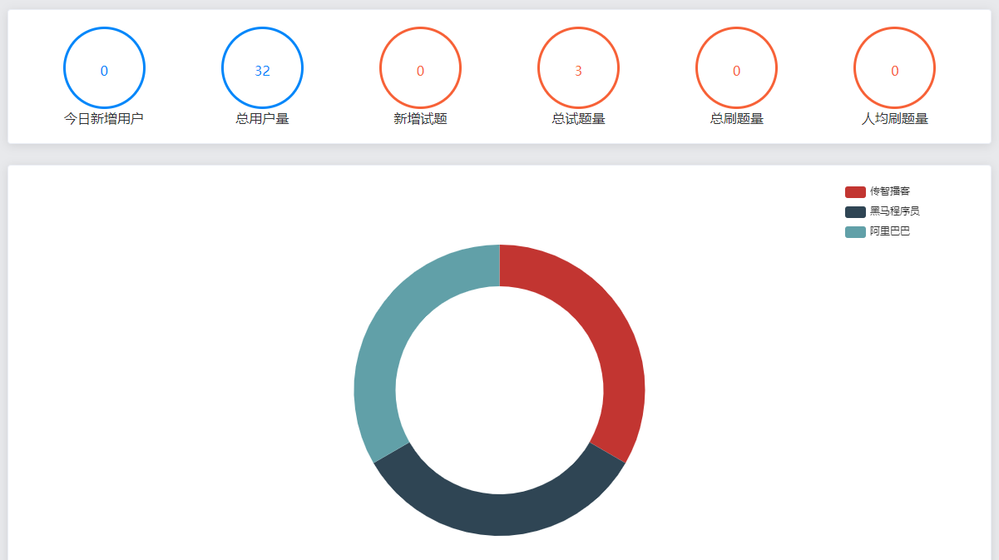

# Day07

## 数据预览

### 效果:



### 实现步骤：

> 获取数据

```vue
<script>
	export default {
        created () {
            this.getTitleData()
        },
        mounted () {
            this.getStatisticsData()
        },
        methods: {
            async getTitleData () {
                const res = await this.$axios.post('/data/title')

                if (res.data.code === 200) {
                    this.titleObj = res.data.data
                }
            },
            async getStatisticsData () {
                const res = await this.$axios.post('/data/statistics')

                if (res.data.code === 200) {
                    this.statistics = res.data.data

                    // 使用echarts进行渲染
                    this.initEcharts()
                }
            }
        }
    }
</script>
```

> 使用Echarts渲染UI界面

```vue
<template>
  <div class="chart">
    <el-card>
      <ul class="list">
        <li>
          <div class="itemContent color1">{{ titleObj.increment_users }}</div>
          <p>今日新增用户</p>
        </li>
        <li>
          <div class="itemContent color1">{{ titleObj.total_users }}</div>
          <p>总用户量</p>
        </li>
        <li>
          <div class="itemContent color2">
            {{ titleObj.increment_questions }}
          </div>
          <p>新增试题</p>
        </li>
        <li>
          <div class="itemContent color2">{{ titleObj.total_questions }}</div>
          <p>总试题量</p>
        </li>
        <li>
          <div class="itemContent color3">
            {{ titleObj.personal_questions }}
          </div>
          <p>人均刷题量</p>
        </li>
        <li>
          <div class="itemContent color3">
            {{ titleObj.total_done_questions }}
          </div>
          <p>总刷题量</p>
        </li>
      </ul>
    </el-card>
    <el-card style="margin-top:15px;">
      <div class="echarts" ref="echartsRef"></div>
    </el-card>
  </div>
</template>

<script>
	export default {
        methods: {
            initEcharts () {
              // 基于准备好的dom，初始化echarts实例
              var myChart = echarts.init(this.$refs.echartsRef)

              const legendData = this.statistics.map(item => item.name)

              // 指定图表的配置项和数据
              var option = {
                tooltip: {
                  trigger: 'item',
                  formatter: '{a} <br/>{b}: {c} ({d}%)'
                },
                legend: {
                  orient: 'vertical',
                  right: 60,
                  data: legendData
                },
                series: [
                  {
                    name: '访问来源',
                    type: 'pie',
                    radius: ['50%', '70%'],
                    avoidLabelOverlap: false,
                    label: {
                      show: false,
                      position: 'center'
                    },
                    emphasis: {
                      label: {
                        show: true,
                        fontSize: '30',
                        fontWeight: 'bold'
                      }
                    },
                    labelLine: {
                      show: false
                    },
                    data: this.statistics
                  }
                ]
              }

              // 使用刚指定的配置项和数据显示图表。
              myChart.setOption(option)
            }
        }
    }
</script>

<style lang="less">
.chart {
  .list {
    //弹性例子布局
    display: flex;
    //主轴分布
    justify-content: space-around;
    //侧轴分布
    align-items: center;
    //文本居中
    text-align: center;
    //颜色处理
    .color1 {
      border: 3px solid #0086fa;
      color: #0086fa;
    }
    .color2 {
      border: 3px solid #f76137;
      color: #f76137;
    }
    .color3 {
      border: 3px solid #55cd78;
      color: #55cd78;
    }
    //画圈圈
    .itemContent {
      border-radius: 50%;
      width: 99px;
      height: 99px;
      line-height: 99px;
    }
  }
  .echarts {
    height: 500px;
  }
}
</style>
```

